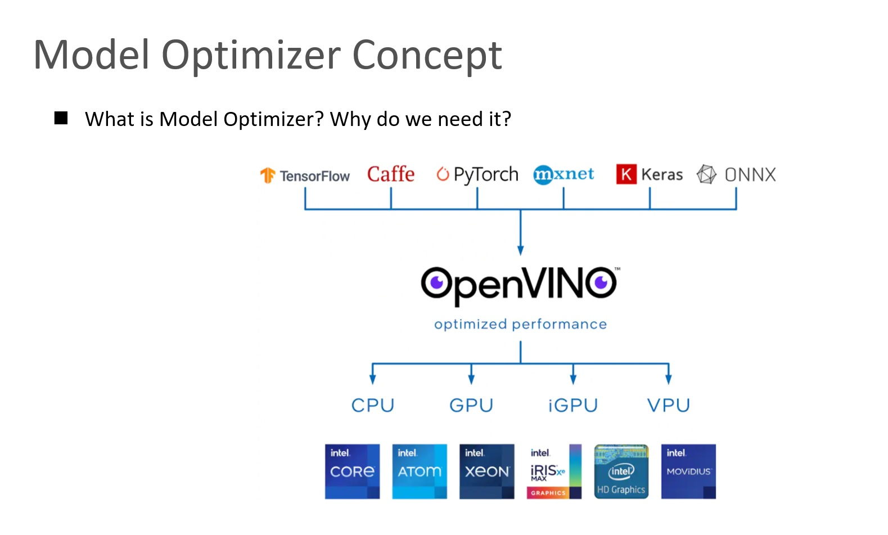
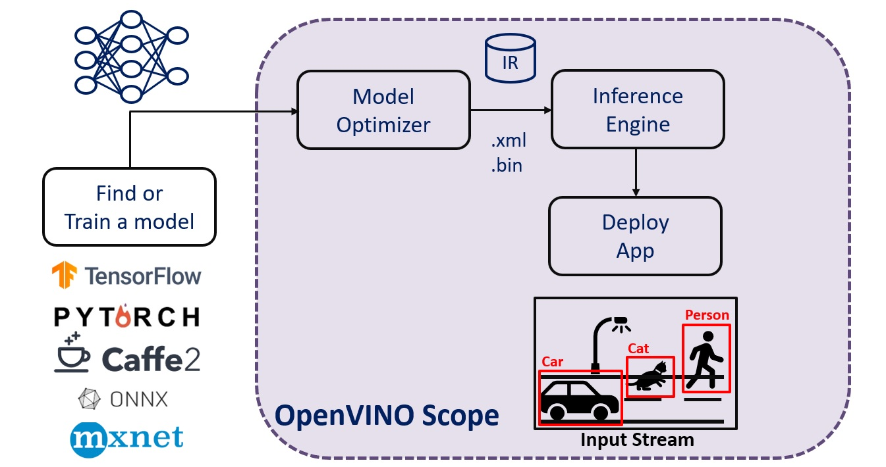
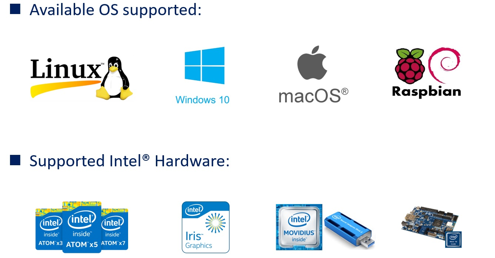
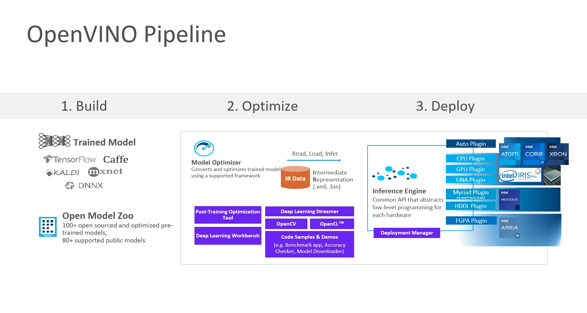

# openvino-quick-start
Easily get started with interesting AI inference in a hour by using OpenVINO.

## Overview
Today, everybody talks about Artificial Intelligence (AI). It is growing rapidly and its market is on fire.  OpenVINO is a power toolkit that that you can easily develop and deploy AI solutions with Intel® platforms, on the Cloud or on the Edge.  Following the repository instruction to quickly kick-start your AI journey!

- What is OpenVINO?

  - OpenVINO stands for Open Visual Inferencing and Neural Network Optimization. It is a toolkit that you can develop and deploy computer vision oriented solutions on Intel® platforms, on the Cloud or on the Edge.
  
- What is the usage of OpenVINO?

  - The usages are really endless. Doesn't matter if you'd like to add visual understanding capabilities to a surveillance camera, to a retail store camera, in a factory, in a cross road to automate the smart city. It doesn't matter what industry you are in, the same tools will help you integrate Artificial Intelligence and video processing.

## Model Optimizer



### What is the Model Optimizer?

- So what exactly is the model optimizer? Why do you need it? What’s the main capabilities? And how does it work?
  - It is the bridge between the trained model and inference engine in a nutshell.
  - We learned that inference flow: We need to take a pre-trained model. We need to prepare it for inference.
  - The full OpenVINO inference flow is to take a pre-trained model first, and then use model optimizer to convert it to a unified data format called ‘IR’ (abbreviation of Intermediate Representation). It basically consist of model topology (.xml) and model weights (.bin). After that, we can use it for prediction by inference engine API, by your application.

- What is the problem we are trying to solve?
  - There are many deep learning frameworks widely used in the industry such as TensorFlow, PyTorch, Caffe, MXNet. And we see a new one every few months. **We want to use ALL these models for inference.**
  - Intel provides a wide range of devices and platforms to choose from. CPUs: Atom based, Core based (i3, i5, i7), Xeon based (gold platinum). Most of these CPUs has integrated GPU.
  - Intel has also acquired Movidius and now offer a range of platforms based on Movidius VPU. And of course, a few different families of FPGA.
  - Mapping from each of these SW suits to any of these HW devices is a complex task. Because:
    - First the representation of DL model is totally different from one framework to the other (take TensorFlow representation vs. Caffe for example).
    - Second, each of these devices has a different architecture, different instruction and a programming model.

So, Intel does not tell you – “OK, these are the devices, go invest the time to learn how to program a VPU or an FPGA, which obviously takes time and expertise.”<br>
Instead, Intel supplies **a one common API that could be used to implement inference across all of these devices and basically abstract HW for you.**

## Inference Engine



### What is the Inference Engine?

- Optimized for Intel® hardware.
  - It provides hardware-based optimizations to get even further improvements from a model.
  
- Running the actual inference at the edge.
  - It only works with the Intermediate Representation (IR) files.
  - They (IR) are come from Intel® Open Model Zoo. Or we can produce them from the Model Optimizer.

- Consists of a high-level API so that we can utilize on the edge application easily.
  - It is built with C++ for faster operations.
  - We can use the built-in Python wrapper to work with the inference engine.



## Pipeline

- Build: Prepare the data, app, and model. The model can be obtained by:
 - Use Pretrained Models: Find an open-source pretrained model from Open Model Zoo.
 - Train Your Model: Use your framework of choice to prepare and train a deep learning model. Or you can use scripts or a manual process to configure the Model Optimizer for the framework used to train the model.
 - Optimize: Run the model optimizer to convert your model and prepare it for inferencing. Note that if your model is downloaded via `omz_downloader` tool. the data is directly in IR format so you do not have to conduct optimization. You can skip this step.
 - Deploy: Tune for ferformance. Use the OpenVINO Runtime API (Inference Engine) to compile the optimized network and manage inference operations on specified devices.
 


## System Environment

- OS: Windows 11 Home
- CPU: Intel(R) Core(TM) i7-1065G7 CPU @ 1.30GHz   1.50 GHz
- RAM: 16.0 GB
- Anaconda: conda 4.11.0
- Python: 3.8.12
- OpenVINO: 2022.1.0

## Run

Open the Anaconda Prompt. Activate the environment we just created.<br>
```
conda activate ov_2022_dev
```

After that, clone this repo to your local machine.<br>
```
git clone https://github.com/jonathanyeh0723/openvino-quick-start
```

You should be able to see the following outputs from the console.<br>
```
Cloning into 'openvino-quick-start'...
remote: Enumerating objects: 65, done.
remote: Counting objects: 100% (65/65), done.
remote: Compressing objects: 100% (44/44), done.
Receiving objects: 100% (65/65), 6.72 MiB | 3.74 MiB/sk-reused 0 eceiving objects:  55% (36/65), 5.95 MiB | 3.74 MiB/s
68 MiB/s, done.
Resolving deltas: 100% (22/22), done.
```

Once it's done, change your working directory to the cloned directory.<br>
```
cd openvino-quick-start
```

Now we'll need to install the required dependencies for this project by typing the below commands:<br>
```
pip install -r requirements.txt
```

**Note: If you encounter some error messages in this step like below, just ignore it. It's about the tensorflow-gpu related compatibility. For the showcase of OpenVINO inference, we do not need to enable it now.**
```
ERROR: pip's dependency resolver does not currently take into account all the packages that are installed. This behaviour is the source of the following dependency conflicts.
tensorflow-gpu 2.3.0 requires gast==0.3.3, which is not installed.
tensorflow-gpu 2.3.0 requires grpcio>=1.8.6, which is not installed.
tensorflow-gpu 2.3.0 requires h5py<2.11.0,>=2.10.0, which is not installed.
tensorflow-gpu 2.3.0 requires scipy==1.4.1, which is not installed.
tensorflow-gpu 2.3.0 requires six>=1.12.0, which is not installed.
tensorflow-gpu 2.3.0 requires tensorboard<3,>=2.3.0, which is not installed.
tensorflow-gpu 2.3.0 requires wrapt>=1.11.1, which is not installed.
keras-preprocessing 1.1.2 requires six>=1.9.0, which is not installed.
tensorflow-gpu 2.3.0 requires numpy<1.19.0,>=1.16.0, but you have numpy 1.19.5 which is incompatible.
```

OK! We're all set. Let's perform the inference.<br>
```
python quick_start.py
```

You should be able to see the following results, if successful. It indicates that the top five labeled object index with corespondent probability inferred.<br>
```
Inference Results:
id: 511, target: convertible, prob: 12.158
id: 436, target: beach wagon, station wagon, wagon, estate car, beach waggon, station waggon, waggon, prob: 11.670
id: 817, target: sports car, sport car, prob: 11.610
id: 717, target: pickup, pickup truck, prob: 11.348
id: 479, target: car wheel, prob: 10.920
```
